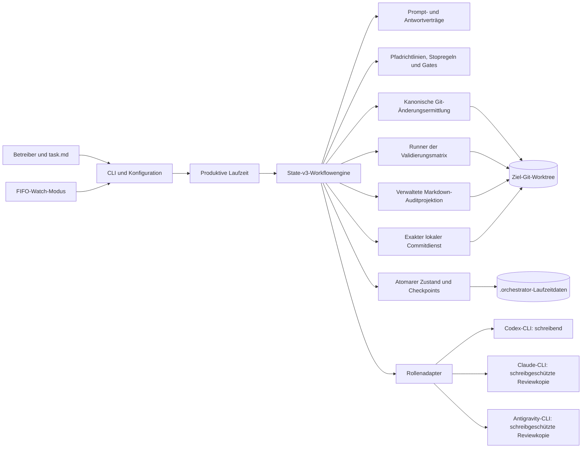
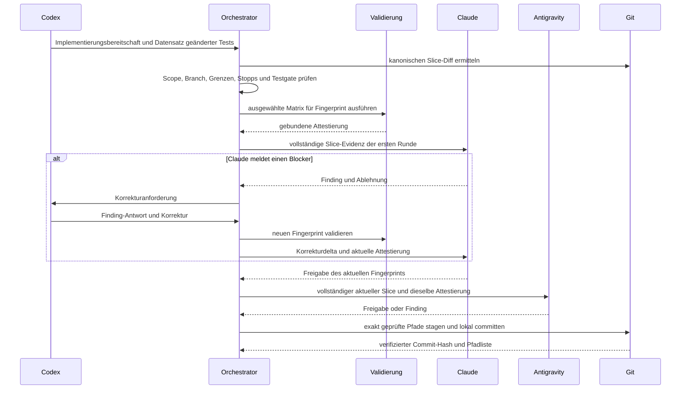

# Architektur- und Fachkonzept

**Dokumentstatus:** Referenzdokumentation der State-v3-Implementierung

**Zuletzt verifiziert:** 2026-08-13

**Zielgruppe:** Maintainer, Betreiber, Reviewer und Teams, die den Orchestrator evaluieren

## 1. Zweck

Der Dual-Agent Task Orchestrator ist eine lokale Steuerungsebene für begrenzte Softwareänderungen. Er ersetzt keinen Coding-Agenten und stellt kein eigenes Modell bereit. Stattdessen koordiniert er drei unabhängig konfigurierte Agenten-CLIs rund um ein Git-Repository:

- Codex plant und implementiert.
- Claude prüft den Plan und führt gezielte Slice-Reviews aus.
- Antigravity übernimmt den unabhängigen Abschlussreview jedes freigegebenen Slice und des vollständigen Branches.

Das System überführt einen informellen Markdown-Auftrag in eine persistierte Folge kleiner, prüfbarer, validierter und lokal commiteter Änderungen. Sein zentrales Entwurfsziel ist nicht maximale Autonomie, sondern kontrollierte Autonomie mit Evidenz, die einem exakten Repositoryzustand zugeordnet bleibt.

## 2. Fachliches Problem

Langlaufende Coding-Agenten-Sitzungen können auf Arten scheitern, die im Nachhinein schwer unterscheidbar sind:

- Die Implementierung überschreitet den beabsichtigten Dateiumfang.
- Ein Reviewer sieht veraltete oder unvollständige Änderungen.
- Tests werden gegen einen anderen Diff als den geprüften erneut ausgeführt.
- Derselbe Agent implementiert, validiert, genehmigt und commitet seine eigene Arbeit.
- Ein Quota- oder Prozessfehler verliert den exakten Fortsetzungspunkt.
- Ein breiter Agenten-Commit nimmt fremde Worktree-Änderungen auf.
- Eine Freigabe bleibt nur als Prosa erhalten und ist nicht an konkrete Evidenz gebunden.

Der Orchestrator bildet diese Bedingungen als expliziten Zustand, Verträge und Gates ab. Ein erfolgreiches Ergebnis bedeutet daher mehr als „ein Agent meldet Erfolg“: Die erwartete Validierungsmatrix war für den geprüften Fingerprint erfolgreich, beide erforderlichen Reviewer haben ihn in der vorgeschriebenen Reihenfolge freigegeben, kein blockierendes Finding blieb offen und der lokale Commit enthielt exakt die autorisierten Pfade.

## 3. Scope und Systemgrenze

### Im Scope

- ein Git-Worktree und Feature-Branch je aktivem Lauf;
- eine Markdown-Aufgabe, überführt in einen oder mehrere geordnete Slices;
- lokale Aufrufe der Codex-, Claude- und Antigravity-CLIs;
- kanonische Ermittlung von Git-Änderungen und SHA-256-Fingerprints;
- Pfadklassifizierung, Stopregeln, Validierung, Findings, Gates, Checkpoints, Auditprojektion und lokale Commits;
- Einzelaufgaben- und FIFO-Watch-Betrieb;
- deterministische skriptgesteuerte Probeläufe zur Workflowverifikation.

### Außerhalb der Systemgrenze

- Modellhosting und Providerauthentifizierung;
- Quellcodehosting, Pull-Request-Erstellung, Merge, Release und Deployment;
- organisationsweite Zeitplanung oder verteilte Jobausführung;
- ein semantischer Korrektheitsbeweis für generierten Code jenseits konfigurierter Validierungen und Reviews;
- automatische Migration aktiver State-v2-Läufe;
- native Windows-Unterstützung.

## 4. Akteure und Verantwortlichkeiten

| Akteur | Verantwortung | Besitzt ausdrücklich nicht |
|---|---|---|
| Betreiber | Definiert Aufgabe und Richtlinien, löst Gates auf, stellt Zugangsdaten bereit und entscheidet über externe Git-Aktionen. | Agentenurteile oder synthetische Validierungsbehauptungen. |
| Codex | Erstellt den Slice-Plan, bearbeitet den erlaubten Scope, beantwortet Findings und erstellt den branchweiten Implementierungsbericht. | Freigabe, deterministische Validierung oder Git-Commit-Autorisierung. |
| Claude | Prüft Plan, ersten vollständigen Slice-Diff und spätere Korrekturdeltas. Besitzt den Lebenszyklus eigener Findings. | Quelländerungen, Validierungsausführung, Commits oder Antigravitys Urteil. |
| Antigravity | Prüft den vollständigen, von Claude freigegebenen Slice einmal und schließt den Branchreview unabhängig ab. Besitzt die eigenen Findings. | Planreview, Quelländerungen, Validierungsausführung oder Commits. |
| Orchestrator | Besitzt Zustandsübergänge, kanonische Evidenz, Validierung, Isolation, Richtlinien-Gates, Auditprojektion und exakte lokale Committransaktionen. | Produktanforderungen oder menschliche Risikoakzeptanz. |
| Git-Repository | Liefert Branchidentität, Merge-Basis, Worktreezustand, Diffs und dauerhafte Commit-Historie. | Workflowrichtlinien. |

## 5. Zentrale Fachbegriffe

| Begriff | Bedeutung |
|---|---|
| Lauf | Eine persistierte Ausführung einer Aufgabe auf einem Repositorybranch und seiner Branchbasis. |
| Geplanter Slice | Einsbasierte Einheit mit Zusammenfassung und exakter repositoryrelativer Pfad-Allowlist. |
| Arbeitsblock | Fortsetzbarer Ausführungskontext für Planung, Slice, Korrektur oder Abschlussreview. |
| Schritt | Exakt nächste Rollen- oder Orchestratoraktion innerhalb eines Arbeitsblocks. |
| Slice-Grenze | Persistierter Branch, Startcommit, Startfingerprint, erlaubte Pfade und Änderungsgruppen. |
| Kanonische Änderungen | Von Git abgeleitete, nachverfolgte und nicht ignorierte unversionierte Änderungen ab einem expliziten Basiscommit. |
| Diff-Fingerprint | SHA-256-Identität der kanonischen Änderungsmenge einschließlich relevanter Inhalte und Metadaten. |
| Validierungsmatrix | Deterministische Befehlsmenge, ausgewählt aus geänderten Pfaden und Abnahmebefehlen von Findings. |
| Attestierung | Vom Orchestrator erzeugte Validierungsdatensätze, gebunden an einen Diff-Fingerprint. |
| Finding | Reviewer-eigener Blocker oder Hinweis mit stabiler Identität, Beschreibung, Abnahmetest und Lebenszyklus. |
| Gate | Persistierter Halt, der Richtlinienreparatur, explizite Benutzeraktion, Quota-Reset oder Agentenwiederherstellung erfordert. |
| Auditprojektion | Menschenlesbares Markdown, das aus strukturierten Workflowereignissen in geschützte Abschnitte geschrieben wird. |

## 6. Architekturprinzipien und Invarianten

### 6.1 Funktionstrennung

Implementierung, Validierung, Review und Commit-Autorisierung sind getrennte Verantwortlichkeiten. Kein Agent darf die eigene Arbeit freigeben, Reviewer dürfen keine Validierungsevidenz erfinden und der Orchestrator darf ein negatives Urteil nicht als Freigabe interpretieren.

### 6.2 Git ist die Änderungsautorität

Von Agenten gemeldete Dateilisten sind nur additive Hinweise. Kanonische Pfade und Diffs stammen aus Git und berücksichtigen Umbenennungen, Löschungen, Binärmetadaten, nachverfolgte Änderungen sowie nicht ignorierte unversionierte Dateien. Ein unerwarteter Pfad führt zu einem geschlossenen Fehlerzustand.

### 6.3 Evidenz ist an Fingerprints gebunden

Validierung und Reviews beziehen sich auf genau einen Diff-Fingerprint. Jede semantische Änderung entwertet die vorherige Evidenz. Inhalte verwalteter Auditabschnitte sind vom semantischen Markdown-Fingerprint ausgenommen, damit die deterministische Projektion nicht den Review ungültig macht, der sie autorisiert hat.

### 6.4 Reviews sind asymmetrisch

Claude sieht in der ersten Runde die vollständige Slice-Evidenz und in späteren Runden nur das relevante Korrekturdelta. Antigravity wird nach Claudes Freigabe des aktuellen Fingerprints ausgeführt und erhält den vollständigen aktuellen Slice. Dadurch bleibt wiederholter Reviewkontext klein, ohne auf eine unabhängige Abschlussprüfung zu verzichten.

### 6.5 Validierung besitzt genau einen Eigentümer

Nur der Orchestrator führt die ausgewählte Validierungsmatrix aus. Das Ergebnis wird für einen Fingerprint zwischengespeichert und von beiden Reviewern wiederverwendet. Reviewer dürfen die Attestierung prüfen, aber keinen eigenen Validierungsergebnis-Marker ausgeben.

### 6.6 Persistierung erfolgt vor fortsetzbarem Exit

Zustand und koordinatenspezifischer Checkpoint werden geschrieben, bevor ein Benutzergate, Quotawarten oder fortsetzbarer Agentenfehler die Kontrolle zurückgibt. Die Fortsetzung beginnt am persistierten Schritt und prüft relevante Repositoryevidenz erneut.

### 6.7 Commits sind exakte Transaktionen

Der Commitdienst prüft die Autorisierung erneut, staged nur geprüfte Pfade, erstellt einen lokalen Slice-Commit und verifiziert Pfadliste und Hash. Push, Merge, Force-Push und Umschreiben der Historie bleiben außerhalb der Produktgrenze.

## 7. Logische Architektur

Die Workflowengine ist bewusst von der Prozessausführung getrennt. Sie kommuniziert über ein Driver-Protokoll. Der produktive Driver bindet dieses Protokoll an reale CLIs, Git, Validierung, Zustandsspeicherung und Auditdateien; skriptgesteuerte Szenarien binden es an deterministische Test-Doubles.

## 8. Komponentenmodell

| Komponente | Primäre Module | Verantwortung |
|---|---|---|
| CLI und Konfiguration | [`src/cli.py`](../../src/cli.py), [`src/agent_config.py`](../../src/agent_config.py) | CLI-/Umgebungs-/TOML-Präzedenz, Rolleneinstellungen, Logging und Dispatch. |
| Produktive Komposition | [`src/orchestrator.py`](../../src/orchestrator.py) | Laufzeitabhängigkeiten aufbauen, Zustand laden oder erzeugen, produktiven Driver binden und Lauf ausführen. |
| Workflowengine | [`src/workflow.py`](../../src/workflow.py) | Übergänge, Reviewerreihenfolge, Evidenzaktualität, Korrekturen, Abschlussreview und Exitsemantik durchsetzen. |
| Zustandsmodell | [`src/workflow_state.py`](../../src/workflow_state.py) | Unveränderliche State-v3-Datensätze, Arbeitsblöcke, Schritte, Slices, Gates, Fehler und Übergangsinvarianten definieren. |
| Antwortverträge | [`src/contracts.py`](../../src/contracts.py), [`src/prompts.py`](../../src/prompts.py) | Rollenspezifische Prompts und geschlossen fehlschlagendes Parsing für Bereitschaft, Freigaben, Findings, Evidenz und Stopanforderungen. |
| Agentengrenze | [`src/agent_adapters.py`](../../src/agent_adapters.py), [`src/agent_runtime.py`](../../src/agent_runtime.py) | Providerbefehle bauen, Ausgabe streamen, Fehler und Quota-Resets klassifizieren sowie Reviewer isolieren. |
| Repositoryevidenz | [`src/repo_changes.py`](../../src/repo_changes.py), [`src/path_policy.py`](../../src/path_policy.py) | Repositorypfade auflösen, kanonische Änderungen erfassen und vollständige beziehungsweise Teil-Fingerprints berechnen. |
| Richtlinien und Validierung | [`src/gates.py`](../../src/gates.py), [`src/validation_matrix.py`](../../src/validation_matrix.py) | Pfade klassifizieren, Test-/Ankeränderungen erkennen, Grenzwerte und Stopregeln durchsetzen sowie Validierung auswählen und ausführen. |
| Git-Transaktion | [`src/git_service.py`](../../src/git_service.py) | Slice-Grenzen persistieren, Autorisierung prüfen, exakte Pfade stagen, lokal committen und Ergebnis verifizieren. |
| Persistierung und Audit | [`src/state_io.py`](../../src/state_io.py), [`src/audit_trail.py`](../../src/audit_trail.py) | Atomare State-/Checkpoint-Schreibvorgänge und sichere, idempotente Auditprojektion. |
| Warteschlangenbetrieb | [`src/inbox_watcher.py`](../../src/inbox_watcher.py) | FIFO-Sperre, Aufgabenidentität, Stabilitätsprüfung, Wiederholungen, fortsetzbare Pausen und Outbox-Verschiebung verwalten. |
| Deterministische Simulation | [`src/dry_run_scenarios.py`](../../src/dry_run_scenarios.py) | Produktive Übergänge ohne Agentenaufrufe oder Repositoryschreibzugriffe durchlaufen. |

## 9. Vollständiger Workflow

### 9.1 Planung

1. Die Laufzeit ermittelt Repository, aktiven Branch, Merge-Basis, Aufgabendigest, Konfiguration und vorhandenen Zustand.
2. Codex liefert geordnete `SLICE_PLAN`-Datensätze mit exakten Pfad-Allowlists.
3. Claude prüft den Plan. Eine Ablehnung führt zur Planüberarbeitung durch Codex; Antigravity ist an der Planung nicht beteiligt.
4. Der freigegebene Plan wird persistiert, bevor der erste Implementierungsslice beginnt.

### 9.2 Slice-Implementierung und Review

Lehnt Antigravity einen Slice ab, läuft die Korrektur über Codex und Claude zurück, bevor Antigravity den neuen Fingerprint prüfen darf. Eine rein formale Antwortreparatur erhält die abgelehnte Antwort und den Marker-Vertrag, nicht erneut die Implementierungsevidenz.

### 9.3 Branchweiter Abschluss

Nachdem alle geplanten Slices commitet sind:

1. wird der vollständige Branch-Diff ab der persistierten Branchbasis ermittelt;
2. validiert der Orchestrator diesen Branch-Fingerprint;
3. erstellt Codex einen abschließenden Implementierungsbericht;
4. prüfen Claude und Antigravity unabhängig den vollständigen Branch;
5. erzeugt ein blockierendes Abschlussfinding einen begrenzten Korrekturarbeitsblock und lokalen Korrekturcommit;
6. werden vollständige Branchvalidierung und Abschlussreview aller drei Rollen wiederholt;
7. endet nur der terminal freigegebene Zustand erfolgreich.

## 10. Finding- und Entscheidungsmodell

Ein Finding gehört dauerhaft dem Reviewer, der es erstellt hat. Claude-IDs beginnen mit `C-`, Antigravity-IDs mit `A-`. Ein Finding enthält:

- stabile ID und Herkunft;
- Klassifizierung als `BLOCKER` oder `OBSERVATION`;
- unveränderliche Beschreibung und Abnahmetest;
- Eigentümer-gesteuerten Status `OPEN` oder `CLOSED`;
- explizite Codex-Antwort `ACCEPTED` oder `REJECTED`.

Ein offener Blocker verhindert eine positive Freigabe. Eine Observation bleibt sichtbar, blockiert aber nicht automatisch. Ein Reviewer darf das Finding eines anderen Reviewers weder schließen noch stillschweigend neu klassifizieren. Dadurch bleibt die Zuordnung über Korrekturrunden und Fortsetzungsgrenzen hinweg erhalten.

## 11. Validierungs- und Evidenzmodell

Das Repository-TOML klassifiziert produktive, Test-, Dokumentations- und generierte Pfade. Die Validierungsauswahl kombiniert:

- den Standardbefehl des Repositorys;
- jede Regel, deren Pfadmuster auf die kanonische Änderungsmenge passt;
- strukturierte Abnahmebefehle offener Findings, sofern sie innerhalb einer erlaubten Validierungsfamilie bleiben.

Befehle werden dedupliziert und mit begrenzten Timeouts ausgeführt. Die Attestierung protokolliert erwartete Matrix, Befehlsstatus, Exitcode, kompakte Ausgabe und Digest. `INCOMPLETE` unterscheidet sich von einem vollständig ausgeführten fehlgeschlagenen Befehl: Fehlende Werkzeuge oder nicht verfügbare Ausführung dürfen nicht stillschweigend freigegeben werden. Eine bewusste Red-State-Ausnahme erfordert einen benannten Folgeslice; für unvollständige Evidenz existiert keine solche Ausnahme.

## 12. Sicherheits- und Vertrauensgrenzen

### Dateisystem- und Prozessisolation

Codex arbeitet mit Schreibzugriff auf den Ziel-Worktree. Jeder Reviewer läuft in einer temporären Repositorykopie, deren nachverfolgter Inhalt schreibgeschützt ist, während providerspezifische Laufzeit-, Prompt-, Cache- und Logpfade beschreibbar bleiben. Dadurch können gewöhnliche Reviewprompts die zu bewertende Quellevidenz nicht verändern.

### Repositorybegrenzung

Repositoryrelative Pfade werden normalisiert, Parent-Traversal und fremde absolute Pfade abgelehnt sowie Symlink-Ausbrüche geprüft. Umbenennungsgruppen behalten für Scope-, Gate- und Commitentscheidungen sowohl alten als auch neuen Pfad.

### Nicht vertrauenswürdiger Text

Aufgabeninhalt, Diffs, Agentenantworten und Auditprosa werden als Daten behandelt. Promptabschnitte sind abgegrenzt; Antwortmarker werden ausschließlich unter strikten Schrittverträgen geparst. Doppelte, fehlende, veraltete oder gefälschte Urteilsmarker führen zu einem geschlossenen Fehlerzustand.

### Menschliche Autorität

Explizite Benutzergates verlangen Akteur, Begründung und den exakten persistierten Fingerprint. Die Entscheidung wird protokolliert, bevor der Workflow fortfährt. Destruktive externe Git-Aktionen werden niemals aus einem erfolgreichen lokalen Lauf abgeleitet.

## 13. Persistierung, Fortsetzung und Idempotenz

`.orchestrator/state.json` ist die maschinenlesbare Quelle des aktiven Laufs. Arbeitsblock-Checkpoints kodieren einsbasierte Arbeitsblock-, Slice- und Rundenkoordinaten. Persistierte Agentenausgaben ermöglichen die Wiederherstellung von Planungs- oder Implementierungskontext, ohne bereits abgeschlossene Seiteneffekte zu wiederholen.

Bei der Fortsetzung werden Aufgabenidentität, gegebenenfalls Laufidentität, Branch, Schritt und Evidenz geprüft. Ein geänderter Fingerprint während des Quotawartens oder nach dem Review führt zu einem Halt, statt eine veraltete Freigabe wiederzugeben. Commitabschluss und Erfolgsmarker des Watch-Modus werden persistiert, damit ein Neustart weder erfolgreichen Commit noch abgeschlossene Aufgabe wiederholt.

State-v2-Daten sind ausschließlich historisch. Ein aktiver oder eingefrorener State-v2-Lauf wird unverändert abgelehnt und nicht in das State-v3-Modell hineingeraten.

## 14. Gates und Fehlersemantik

Die CLI stellt stabile Exitkategorien bereit:

| Exit | Bedeutung | Fortsetzungsverhalten |
|---:|---|---|
| 0 | Vollständiger Workflow einschließlich Abschlussreviews. | Keine Fortsetzung erforderlich. |
| 1 | Technischer, Konfigurations-, Schema-, Repository-, Validierungs- oder interner Workflowfehler. | Gemäß Diagnose reparieren; Fortsetzbarkeit hängt vom persistierten Zustand ab. |
| 2 | Quotawarten kann nicht automatisch abgeschlossen werden. | Nach Quotawiederherstellung denselben Rollenschritt fortsetzen. |
| 3 | Erforderliche Agenteninstanz ist fehlgeschlagen oder nicht verfügbar. | Provider-/Binärprogrammursache beheben und denselben Schritt fortsetzen. |
| 4 | Explizite Benutzer- oder Richtlinienentscheidung ist erforderlich. | An Fingerprint gebundene Gate-Entscheidung protokollieren und fortsetzen. |

Eine automatische Quotafortsetzung erfolgt nur bei einem eindeutigen Reset innerhalb der Richtliniengrenzen, mit Sicherheitsmarge und Heartbeats. Es gibt keine Ersatzrolle, weil eine Substitution die beabsichtigte Funktionstrennung ungültig machen würde.

## 15. Architektur des Watch-Modus

Der Watch-Modus ist ein lokaler Einzelprozess-FIFO-Worker und keine verteilte Warteschlange:

- stabile Markdown-Aufgaben werden älteste zuerst ausgewählt;
- `inbox/.lock` verhindert konkurrierende Worker, sofern `fcntl` verfügbar ist;
- eine Sidecar-Datei bindet den Aufgabeninhalt an eine Lauf-ID;
- fortsetzbare Exitcodes 2, 3 und 4 erhalten die FIFO-Zuständigkeit und halten die Warteschlange an;
- technische Fehler verwenden begrenzte Wiederholungen und Poison-Task-Behandlung;
- ein Erfolgsmarker verhindert die erneute Ausführung, wenn nur die Outbox-Verschiebung fehlschlug.

Dieser Entwurf optimiert einen deterministischen lokalen Betrieb. Horizontale Skalierung, entfernte Worker und gemeinsame Sperren liegen bewusst außerhalb der aktuellen Architektur.

## 16. Konfigurations- und Bereitstellungssicht

Der Starter verwendet das aktuelle Arbeitsverzeichnis als Zielrepository. Die Richtlinienpräzedenz lautet CLI, Umgebung, Repository-TOML und schließlich integrierte oder erkannte Standards. Einstellungen für Agentenprogramm, Modell, Timeout, Effort und Claude-Budget umgehen bewusst das Repository-TOML, damit Providerzugangsdaten und maschinenspezifische Pfade in der Verantwortung des Betreibers bleiben.

Die Laufzeit benötigt Python 3.11 oder neuer und unterstützt Linux, macOS und WSL2. Sie besitzt neben der Standardbibliothek keine Python-Laufzeitabhängigkeiten. Die externen Rollen-CLIs und Git sind betriebliche Abhängigkeiten und werden verzögert vor ihrer ersten Verwendung geprüft.

## 17. Qualitätsmerkmale

| Merkmal | Architektonische Antwort |
|---|---|
| Auditierbarkeit | Strukturierte Ereignisse, Fingerprint-gebundene Attestierungen, geschützte Markdown-Projektion und verifizierte Commits. |
| Wiederherstellbarkeit | Atomare Zustandswrites, koordinatenspezifische Checkpoints, exakte Schrittfortsetzung und idempotente Seiteneffekte. |
| Sicherheit | Exakte Pfadumfänge, schreibgeschützte Reviewer, geschlossen fehlschlagende Verträge, Benutzergates und keine externen Git-Mutationen. |
| Determinismus | Kanonische Git-Evidenz, stabile Fingerprints, geordnete Slices, Validierungscache und skriptgesteuerte Szenarien. |
| Kostenkontrolle | Gezielte Claude-Korrekturdeltas, rein formale Reparaturprompts, rollenspezifische Quotarichtlinie und keine Reviewer-Wiederholung für unveränderte Fingerprints. |
| Portabilität | Standardbibliotheks-Python und TOML-Richtlinien mit plattformneutralen Repositorymustern. |
| Erweiterbarkeit | Driver-Protokoll, Rollenadapter, Validierungsregeln, Stopregeln, Pfadklassen und deterministische Szenariofixtures. |

## 18. Bekannte Grenzen

- Slices werden bewusst nacheinander ausgeführt; das System parallelisiert keine Implementierungsslices.
- Die feste Produktionstopologie verlangt Codex, Claude und Antigravity, statt einen beliebigen Agentengraphen auszuwählen.
- Reviewvertrauen bleibt qualitativ und modellabhängig, auch wenn der Evidenztransport deterministisch ist.
- Reviewisolation verwendet temporäre lokale Kopien und keine gehärtete entfernte Sicherheitsgrenze.
- Das Produkt erstellt lokale Commits, bietet aber keinen Pull-Request-, Issue-Tracker-, Deployment- oder Organisationsrichtliniendienst.
- Der Watch-Modus ist hostlokal und hängt für exklusive Zuständigkeit von Unix-Sperrsemantik ab.
- Der Orchestrator weist Prozessintegrität nach, nicht die vollständige funktionale Korrektheit der geänderten Software.

## 19. Quellen-der-Wahrheit-Zuordnung

Wenn Dokumentation und Verhalten voneinander abzuweichen scheinen, gilt folgende Reihenfolge:

1. [`src/orchestrator.py`](../../src/orchestrator.py), [`src/workflow.py`](../../src/workflow.py), [`src/workflow_state.py`](../../src/workflow_state.py) und [`src/state_io.py`](../../src/state_io.py) für Laufzeitverhalten und Persistierung;
2. [`src/prompts.py`](../../src/prompts.py) und [`src/contracts.py`](../../src/contracts.py) für Agentenausgabeverträge;
3. [`AGENTS.md`](../../AGENTS.md) und Rollendateien für Repository-Ausführungsrichtlinien;
4. [`README.md`](../../README.md) als öffentliche Betriebsreferenz;
5. dieses Dokument für Architekturbegründung und fachliche Interpretation.

Änderungen an Workflowsemantik, Verträgen, Gates, Validierung, Git-Transaktionen oder Zustandsbehandlung müssen dieses Dokument aktualisieren, sobald eine Architekturaussage dadurch ungültig wird.
