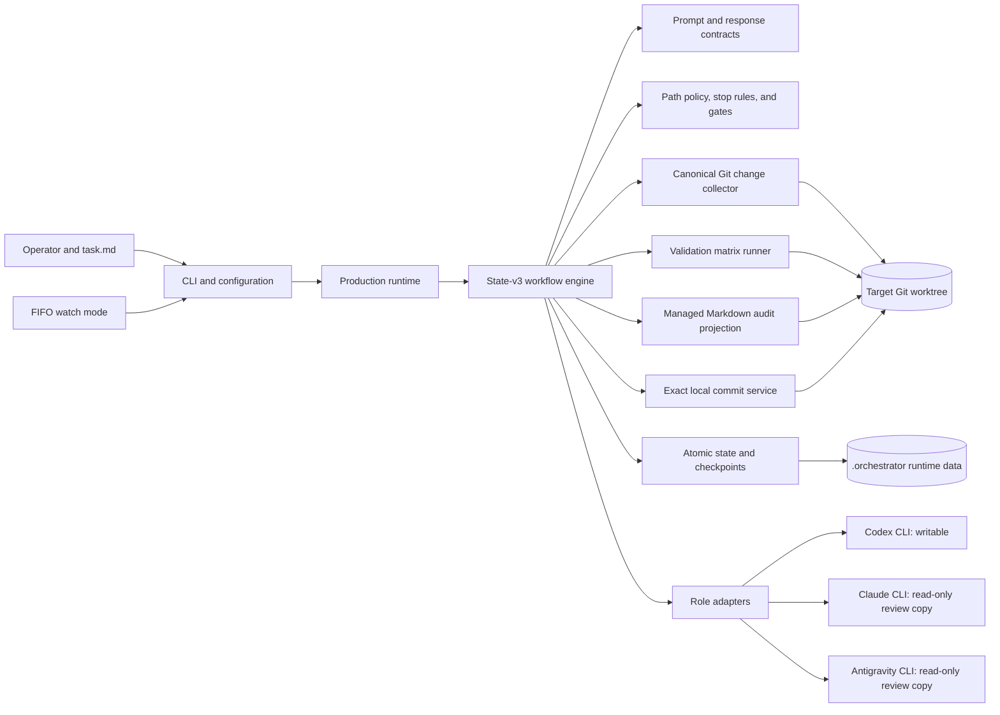
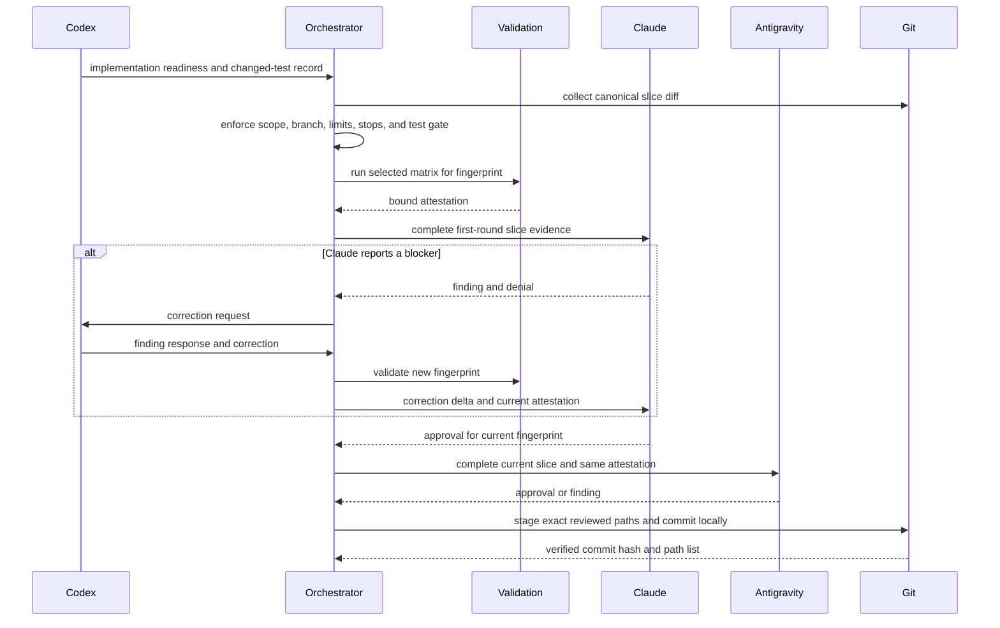

# Architecture and Domain Concept

**Document status:** Reference documentation for the State-v3 implementation

**Last verified:** 2026-08-13

**Audience:** maintainers, operators, reviewers, and teams evaluating the orchestrator

## 1. Purpose

The Dual-Agent Task Orchestrator is a local control plane for bounded software changes. It does not replace a coding agent or provide its own model. It coordinates three independently configured agent CLIs around one Git repository:

- Codex plans and implements.
- Claude reviews the plan and performs targeted slice reviews.
- Antigravity performs an independent closing review of each approved slice and of the complete branch.

The system turns an informal Markdown assignment into a persisted sequence of small, reviewable, validated, and locally committed changes. Its central design goal is not maximum autonomy. It is controlled autonomy with evidence that remains attributable to an exact repository state.

## 2. Domain Problem

Long-running coding-agent sessions commonly fail in ways that are difficult to distinguish after the fact:

- the implementation exceeds the intended file scope;
- a reviewer sees stale or incomplete changes;
- tests are rerun against a different diff than the reviewed one;
- the same agent implements, validates, approves, and commits its own work;
- a quota or process failure loses the exact continuation point;
- a broad agent commit absorbs unrelated worktree changes;
- an approval is remembered as prose but is not bound to concrete evidence.

The orchestrator models those conditions as explicit state, contracts, and gates. A successful result therefore means more than “an agent reported success”: the expected validation matrix passed for the reviewed fingerprint, both required reviewers approved it in order, no blocking finding remained open, and the local commit contained exactly the authorized paths.

## 3. Scope and System Boundary

### In scope

- one Git worktree and feature branch per active run;
- one Markdown task, converted into one or more ordered slices;
- local invocation of Codex, Claude, and Antigravity CLIs;
- canonical Git change collection and SHA-256 fingerprints;
- path classification, stop rules, validation, findings, gates, checkpoints, audit projection, and local commits;
- single-task and FIFO watch operation;
- deterministic scripted dry runs for workflow verification.

### Outside the boundary

- model hosting and provider authentication;
- source hosting, pull-request creation, merge, release, and deployment;
- organization-wide scheduling or distributed job execution;
- semantic proof that generated code is correct beyond configured validation and reviews;
- automatic migration of active State-v2 runs;
- native Windows support.

## 4. Actors and Responsibilities

| Actor | Responsibility | Explicitly does not own |
|---|---|---|
| Operator | Defines the task and policy, resolves gates, supplies credentials, and decides external Git actions. | Agent verdicts or synthetic validation claims. |
| Codex | Produces the slice plan, edits within the allowed scope, answers findings, and prepares the branch-wide implementation report. | Approval, deterministic validation, or Git commit authorization. |
| Claude | Reviews the plan, the first complete slice diff, and later correction deltas. Owns the lifecycle of findings it reports. | Source edits, validation execution, commits, or Antigravity's verdict. |
| Antigravity | Reviews the complete Claude-approved slice once and independently closes the branch review. Owns its findings. | Plan review, source edits, validation execution, or commits. |
| Orchestrator | Owns state transitions, canonical evidence, validation, isolation, policy gates, audit projection, and exact local commit transactions. | Product requirements or human risk acceptance. |
| Git repository | Supplies branch identity, merge base, worktree state, diffs, and durable commit history. | Workflow policy. |

## 5. Core Domain Language

| Term | Meaning |
|---|---|
| Run | One persisted execution of one task on one repository branch and branch base. |
| Planned slice | A one-based unit with a summary and an exact repository-relative path allowlist. |
| Work unit | A resumable execution context for planning, a slice, a correction, or final review. |
| Step | The exact next role or orchestrator action within a work unit. |
| Slice boundary | The persisted branch, starting commit, starting fingerprint, allowed paths, and change groups. |
| Canonical changes | Git-derived tracked and non-ignored untracked changes collected from an explicit base commit. |
| Diff fingerprint | A SHA-256 identity for the canonical change set, including relevant content and metadata. |
| Validation matrix | The deterministic set of commands selected from changed paths and finding acceptance commands. |
| Attestation | Orchestrator-owned validation records bound to one diff fingerprint. |
| Finding | A reviewer-owned blocker or observation with stable identity, description, acceptance test, and lifecycle. |
| Gate | A persisted halt that requires policy repair, explicit user action, quota reset, or agent recovery. |
| Audit projection | Human-readable Markdown generated from structured workflow events into protected sections. |

## 6. Architectural Principles and Invariants

### 6.1 Separation of duties

Implementation, validation, review, and commit authorization are distinct responsibilities. No agent can approve its own work, reviewers cannot manufacture validation evidence, and the orchestrator cannot reinterpret a negative verdict as approval.

### 6.2 Git is the change authority

Agent-reported file lists are additive hints only. Canonical paths and diffs come from Git, including renames, deletions, binary metadata, tracked changes, and non-ignored untracked files. An unexpected path fails closed.

### 6.3 Evidence is fingerprint-bound

Validation and reviews refer to one exact diff fingerprint. Any semantic change invalidates the prior evidence. Managed audit-body updates are excluded from the semantic Markdown fingerprint so deterministic projection does not invalidate the review that authorized it.

### 6.4 Reviews are asymmetric

Claude sees the complete slice evidence in its first round and only the relevant correction delta on later rounds. Antigravity runs after Claude approves the current fingerprint and receives the complete current slice. This limits repeated reviewer context while preserving an independent closing check.

### 6.5 Validation has one owner

Only the orchestrator executes the selected validation matrix. The result is cached for a fingerprint and reused by both reviewers. Reviewers may inspect the attestation but may not emit their own validation result marker.

### 6.6 Persistence precedes resumable exit

The state and a coordinate-specific checkpoint are written before a user gate, quota wait, or resumable agent failure returns control. Resume continues at the persisted step and revalidates relevant repository evidence.

### 6.7 Commits are exact transactions

The commit service rechecks authorization, stages only reviewed paths, creates a local slice commit, and verifies its path list and hash. Push, merge, force-push, and history rewriting remain outside the product boundary.

## 7. Logical Architecture

The workflow engine is deliberately independent of process execution. It talks to a driver protocol. The production driver binds that protocol to real CLIs, Git, validation, state storage, and audit files; scripted scenarios bind it to deterministic test doubles.

## 8. Component Model

| Component | Primary modules | Responsibility |
|---|---|---|
| CLI and configuration | [`src/cli.py`](../../src/cli.py), [`src/agent_config.py`](../../src/agent_config.py) | Parse CLI/environment/TOML precedence, role settings, logging, and dispatch. |
| Production composition | [`src/orchestrator.py`](../../src/orchestrator.py) | Build runtime dependencies, load or create state, bind the production driver, and execute the run. |
| Workflow engine | [`src/workflow.py`](../../src/workflow.py) | Enforce transitions, reviewer order, evidence freshness, corrections, final review, and exit semantics. |
| State model | [`src/workflow_state.py`](../../src/workflow_state.py) | Define immutable State-v3 records, work units, steps, slices, gates, failures, and transition invariants. |
| Response contracts | [`src/contracts.py`](../../src/contracts.py), [`src/prompts.py`](../../src/prompts.py) | Build role-specific prompts and fail-closed parsing for readiness, approvals, findings, evidence, and stop requests. |
| Agent boundary | [`src/agent_adapters.py`](../../src/agent_adapters.py), [`src/agent_runtime.py`](../../src/agent_runtime.py) | Construct provider commands, stream output, classify failures and quota resets, and isolate reviewers. |
| Repository evidence | [`src/repo_changes.py`](../../src/repo_changes.py), [`src/path_policy.py`](../../src/path_policy.py) | Resolve repository paths, collect canonical changes, and compute full/subset fingerprints. |
| Policy and validation | [`src/gates.py`](../../src/gates.py), [`src/validation_matrix.py`](../../src/validation_matrix.py) | Classify paths, detect test/anchor changes, enforce limits and stop rules, select and run validation. |
| Git transaction | [`src/git_service.py`](../../src/git_service.py) | Persist slice boundaries, verify authorization, stage exact paths, commit locally, and verify the result. |
| Persistence and audit | [`src/state_io.py`](../../src/state_io.py), [`src/audit_trail.py`](../../src/audit_trail.py) | Perform atomic state/checkpoint writes and safe, idempotent audit projection. |
| Queue operation | [`src/inbox_watcher.py`](../../src/inbox_watcher.py) | Own the FIFO lock, task identity, stable-file detection, retries, resumable pauses, and outbox movement. |
| Deterministic simulation | [`src/dry_run_scenarios.py`](../../src/dry_run_scenarios.py) | Exercise production transitions without agent calls or repository writes. |

## 9. End-to-End Workflow

### 9.1 Planning

1. The runtime identifies the repository, active branch, merge base, task digest, configuration, and existing state.
2. Codex returns ordered `SLICE_PLAN` records with exact path allowlists.
3. Claude reviews the plan. A denial returns to Codex for plan revision; Antigravity is not involved in planning.
4. The approved plan is persisted before the first implementation slice starts.

### 9.2 Slice implementation and review

If Antigravity denies a slice, the correction returns through Codex and Claude before Antigravity can review the new fingerprint. A format-only response repair receives the rejected response and marker contract, not the implementation evidence again.

### 9.3 Branch-wide completion

After all planned slices are committed:

1. the complete branch diff is collected from the persisted branch base;
2. the orchestrator validates that branch fingerprint;
3. Codex produces a final implementation report;
4. Claude and Antigravity independently review the full branch;
5. a blocking final finding creates a bounded correction work unit and local correction commit;
6. the full branch validation and three-role final review repeat;
7. only the terminal approved state exits successfully.

## 10. Findings and Decision Model

A finding belongs permanently to the reviewer that created it. Claude IDs start with `C-`; Antigravity IDs start with `A-`. A finding contains:

- a stable ID and origin;
- `BLOCKER` or `OBSERVATION` classification;
- an immutable description and acceptance test;
- `OPEN` or `CLOSED` owner-controlled status;
- Codex's explicit `ACCEPTED` or `REJECTED` response.

An open blocker prevents positive approval. An observation remains visible but does not automatically block. One reviewer cannot close or silently reclassify another reviewer's finding. This preserves attribution across correction rounds and resume boundaries.

## 11. Validation and Evidence Model

The repository TOML classifies productive, test, documentation, and generated paths. The validation selector combines:

- the default repository command;
- every rule whose path patterns match the canonical change set;
- structured acceptance commands from open findings, provided they remain in an allowed validation family.

Commands are deduplicated and executed with bounded timeouts. The attestation records the expected matrix, command status, exit code, compact output, and digest. `INCOMPLETE` is distinct from a completed failing command: missing tools or unavailable execution cannot be approved silently. A deliberate red-state exception requires a named follow-up slice; incomplete evidence has no such override.

## 12. Safety and Trust Boundaries

### Filesystem and process isolation

Codex runs with write access to the target worktree. Each reviewer runs in a disposable repository copy whose tracked content is read-only, while provider-specific runtime, prompt, cache, and log locations remain writable. This prevents ordinary review prompts from altering the source evidence they assess.

### Repository containment

Repository-relative paths are normalized, parent traversal and foreign absolute paths are rejected, and symlink escapes are checked. Rename groups retain both old and new paths for scope, gate, and commit reasoning.

### Untrusted text

Task content, diffs, agent responses, and audit prose are treated as data. Prompt sections are delimited; response markers are parsed only under strict step contracts; duplicate, missing, legacy, or forged verdict markers fail closed.

### Human authority

Explicit user gates require actor, rationale, and the exact persisted fingerprint. The decision is recorded before the workflow continues. Destructive external Git actions are never inferred from a successful local run.

## 13. Persistence, Resume, and Idempotency

`.orchestrator/state.json` is the machine-readable source for the active run. Work-unit checkpoints encode one-based work-unit, slice, and round coordinates. Persisted agent outputs allow planning or implementation context to be restored without repeating already completed side effects.

Resume verifies task identity, run identity where applicable, branch, step, and evidence. A changed fingerprint during quota waiting or after review halts rather than replaying a stale approval. Commit completion and watch-mode success markers are persisted so a restart does not repeat a successful commit or completed task.

State-v2 data is historical only. An active or frozen State-v2 run is rejected without mutation; it is not guessed into the State-v3 model.

## 14. Gates and Failure Semantics

The CLI exposes stable exit categories:

| Exit | Meaning | Resume behavior |
|---:|---|---|
| 0 | Complete workflow including final reviews. | No continuation required. |
| 1 | Technical, configuration, schema, repository, validation, or internal workflow failure. | Repair according to the diagnostic; resumability depends on persisted state. |
| 2 | Quota wait cannot be completed automatically. | Resume the same role step after quota recovery. |
| 3 | Required agent instance failed or is unavailable. | Repair the provider/binary condition and resume the same step. |
| 4 | Explicit user or policy decision is required. | Record the fingerprint-bound gate decision and resume. |

Automatic quota continuation occurs only for an unambiguous reset within policy limits, with a safety margin and heartbeats. There is no fallback role because substitution would invalidate the intended separation of duties.

## 15. Watch-Mode Architecture

Watch mode is a local, single-process FIFO worker rather than a distributed queue:

- stable Markdown tasks are selected oldest first;
- `inbox/.lock` prevents concurrent workers where `fcntl` is available;
- a sidecar binds task content to a run ID;
- resumable exits 2, 3, and 4 preserve FIFO ownership and stop the queue;
- technical failures use bounded retries and poison-task handling;
- a success marker prevents re-execution when only outbox movement failed.

This design optimizes deterministic local operation. Horizontal scaling, remote workers, and shared locking are intentionally outside the current architecture.

## 16. Configuration and Deployment View

The launcher runs against the current working directory as the target repository. Policy precedence is CLI, environment, repository TOML, then built-in or detected defaults. Agent binary, model, timeout, effort, and Claude budget settings deliberately bypass repository TOML so provider credentials and machine-specific paths remain operator concerns.

The runtime requires Python 3.11 or newer and supports Linux, macOS, and WSL2. It has no runtime Python package dependencies beyond the standard library. The external role CLIs and Git are operational dependencies and are checked lazily before first use.

## 17. Quality Attributes

| Attribute | Architectural response |
|---|---|
| Auditability | Structured events, fingerprint-bound attestations, protected Markdown projection, and verified commits. |
| Recoverability | Atomic state writes, coordinate-specific checkpoints, exact-step resume, and idempotent side effects. |
| Safety | Exact path scopes, read-only reviewers, fail-closed contracts, user gates, and no external Git mutations. |
| Determinism | Canonical Git evidence, stable fingerprints, ordered slices, validation caching, and scripted scenarios. |
| Cost control | Targeted Claude correction deltas, format-only repair prompts, role-local quota policy, and no reviewer reruns for unchanged fingerprints. |
| Portability | Standard-library Python and TOML policy with platform-neutral repository patterns. |
| Extensibility | Driver protocol, role adapters, validation rules, stop rules, path classes, and deterministic scenario fixtures. |

## 18. Known Limitations

- Slice execution is intentionally sequential; the system does not parallelize implementation slices.
- The fixed production topology requires Codex, Claude, and Antigravity rather than selecting an arbitrary agent graph.
- Review confidence is qualitative and model-dependent even when evidence transport is deterministic.
- Review isolation uses disposable local copies, not a hardened remote security boundary.
- The product creates local commits but provides no pull-request, issue-tracker, deployment, or organization policy service.
- Watch mode is host-local and depends on Unix locking semantics for exclusive ownership.
- The orchestrator proves process integrity, not complete functional correctness of the changed software.

## 19. Source-of-Truth Map

Use the following order when documentation and behavior appear to disagree:

1. [`src/orchestrator.py`](../../src/orchestrator.py), [`src/workflow.py`](../../src/workflow.py), [`src/workflow_state.py`](../../src/workflow_state.py), and [`src/state_io.py`](../../src/state_io.py) for runtime behavior and persistence;
2. [`src/prompts.py`](../../src/prompts.py) and [`src/contracts.py`](../../src/contracts.py) for agent output contracts;
3. [`AGENTS.md`](../../AGENTS.md) and role files for repository execution policy;
4. [`README.md`](../../README.md) for the public operational reference;
5. this document for architectural rationale and domain interpretation.

Changes to workflow semantics, contracts, gates, validation, Git transactions, or state handling must update this document when they invalidate an architectural statement.
