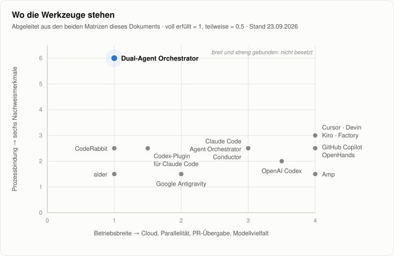

# Marktvergleich

**Recherchestand:** 2026-09-23 · **Orchestrator-Funktionsstand:** 2026-09-23 · **Evidenzrichtlinie:** ausschließlich offizielle Produktseiten und Dokumentationen

Wie sich der Dual-Agent Task Orchestrator zu fünfzehn Coding-Agenten, Agentenplattformen und Prüfwerkzeugen verhält – gemessen an dem, was deren offizielle Dokumentation heute ausdrücklich beschreibt.

## 1. Zusammenfassung

Der Orchestrator ist kein weiterer Coding-Agent. Er ist eine lokale Steuerungsebene, die zwei vorhandene Agenten in feste Rollen setzt: **Codex** plant und baut, **Claude** prüft schreibgeschützt, und der Orchestrator selbst führt die Tests aus, führt Buch und committet – ausschließlich lokal, Arbeitspaket für Arbeitspaket.

> [!TIP]
> **Das Ergebnis dieser Recherche in drei Sätzen.**
> Fast jedes Produkt hat inzwischen eine eigene Prüfinstanz – die Idee „einer baut, ein anderer prüft" ist im Markt angekommen. Was keines der verglichenen Produkte in seinen offiziellen Quellen nachweist, ist die Kombination aus Freigabe und Testergebnis, die an denselben exakten Stand gebunden sind, einer Testausführung außerhalb des Agenten und einer Wiederaufnahme, die abgeschlossene Schritte nicht wiederholt. Dafür verzichtet der Orchestrator auf alles, worin die anderen stark sind: Parallelität, Cloud, Pull Requests und Oberfläche.

<picture>
  <source media="(prefers-color-scheme: dark)" srcset="assets/marktkarte-dunkel.svg">
  
</picture>

> [!NOTE]
> **Wie die Karte zu lesen ist.** Beide Achsen sind aus den Matrizen in Abschnitt 4 und 5 abgezählt, nicht geschätzt. Die senkrechte Achse besteht aus genau den sechs Eigenschaften, für die dieser Orchestrator gebaut wurde; dass er dort oben steht, folgt aus der Wahl der Achse. Die Karte zeigt deshalb eine **Bauentscheidung**, keine Rangfolge: wer auf Breite setzt und wer auf Bindung.

## 2. Lesart

Verglichen wird, was die offiziellen Quellen eines Produkts ausdrücklich beschreiben. Modellqualität, Codequalität, Preis und Geschwindigkeit sind **nicht** Gegenstand; sie ändern sich schnell und lassen sich nur mit kontrollierten Arbeitslasten vergleichen.

| Zeichen | Bedeutung |
|:---:|---|
| ● | fester Bestandteil des Standardablaufs |
| ◐ | vorhanden, aber optional, konfigurierbar oder nur in einem Teil des Produkts |
| ○ | in den geprüften offiziellen Quellen nicht nachgewiesen – das heißt nicht, dass es unmöglich ist |
| — | passt nicht zum Zuschnitt des Produkts |

## 3. Die Vergleichsprodukte

| Gruppe | Produkt | Was es ist |
|---|---|---|
| **Die beiden Motoren** | OpenAI Codex | Coding-Agent von OpenAI, lokal und in der Cloud – im Orchestrator der Implementierer |
| | Claude Code | Coding-Agent von Anthropic, lokal und in der Cloud – im Orchestrator der Prüfer |
| **Herstellerplattform** | Google Antigravity | Agentenzentrierte Entwicklungsplattform von Google; externes Vergleichsprodukt und kein Bestandteil dieses Orchestrators |
| **Plattformen mit Prüfdienst** | GitHub Copilot | Cloud Agent, Code Review und Agent HQ für Claude und Codex auf GitHub |
| | Cursor | KI-IDE mit Cloud Agents, Bugbot und Freigabeagenten |
| | Devin | Autonomer Cloud-Agent von Cognition, dazu Devin Desktop und Devin Review |
| **Agentenplattformen** | Kiro | Spezifikationsgetriebene IDE, CLI und Cloud-Agent von AWS |
| | Factory Droid | Agentenplattform mit Spec Mode und Missions |
| | Amp | Coding-Agent mit herstellerübergreifendem Zweitmodell |
| **Offene Grundlagen** | OpenHands | Quelloffene Agentenplattform und SDK |
| | aider | Quelloffener Terminal-Paarprogrammierer |
| **Nächste Verwandte** | Agent Orchestrator (AO) | Lokale Steuerung vieler Agenten-CLIs mit getrennten Prüfagenten |
| | Conductor | Mac-App für parallele Claude-Code- und Codex-Workspaces |
| | Codex-Plugin für Claude Code | Codex als schreibgeschützter Prüfer in Claude Code |
| | CodeRabbit | Unabhängiger KI-Prüfer für Pull Requests und Agentenschleifen |

## 4. Nachweis und Prozessbindung

Die sechs Merkmale, auf die der Orchestrator ausgelegt ist:

| Produkt | Plan vor Code | Prüfinstanz | Fremdprüfer | Standbindung | Tests extern | Wiederaufnahme |
|---|:---:|:---:|:---:|:---:|:---:|:---:|
| **Dual-Agent Orchestrator** | ● | ● | ● | ● | ● | ● |
| OpenAI Codex | ◐ | ◐ | ○ | ◐ | ○ | ◐ |
| Claude Code | ◐ | ◐ | ○ | ◐ | ◐ | ◐ |
| Google Antigravity | ◐ | ◐ | ○ | ○ | ○ | ◐ |
| GitHub Copilot | ◐ | ◐ | ◐ | ◐ | ◐ | ○ |
| Cursor | ◐ | ◐ | ◐ | ◐ | ◐ | ◐ |
| Devin | ◐ | ◐ | ◐ | ◐ | ◐ | ◐ |
| Kiro | ● | ◐ | ◐ | ○ | ◐ | ◐ |
| Factory Droid | ◐ | ◐ | ◐ | ◐ | ◐ | ◐ |
| Amp | ○ | ◐ | ◐ | ○ | ○ | ◐ |
| OpenHands | ◐ | ◐ | ◐ | ○ | ◐ | ◐ |
| aider | ◐ | ○ | ○ | ○ | ◐ | ◐ |
| Agent Orchestrator (AO) | ◐ | ◐ | ◐ | ○ | ◐ | ◐ |
| Conductor | ◐ | ◐ | ◐ | ○ | ◐ | ◐ |
| Codex-Plugin für Claude Code | — | ● | ● | ○ | ○ | ◐ |
| CodeRabbit | — | ● | ● | ◐ | ○ | ○ |

<b>Was die Spalten genau verlangen</b>

| Merkmal | ● heißt | ◐ heißt |
|---|---|---|
| **Plan vor Code** | Der dokumentierte Standardablauf verlangt einen freigegebenen Plan vor der Umsetzung | Ein Planmodus existiert, ist aber optional |
| **Prüfinstanz** | Eine vom Implementierer getrennte Instanz prüft in jedem Durchlauf | Eine Prüffunktion existiert oder lässt sich konfigurieren |
| **Fremdprüfer** | Der Prüfer stammt fest von einem anderen Hersteller als der Implementierer | Ein Prüfmodell eines anderen Herstellers ist wählbar oder baubar |
| **Standbindung** | Freigabe und Testergebnis gelten nur für einen exakten Fingerabdruck des Diffs und verfallen bei jeder Änderung | Die Prüfung bezieht sich auf einen benannten Commit- oder PR-Stand |
| **Tests extern** | Das Werkzeug selbst – nicht der Agent – führt die Tests aus und bindet das Ergebnis an den geprüften Stand | Ein vom Agenten getrennter Prüfschritt ist integriert oder anschließbar: CI, Hook oder Validator |
| **Wiederaufnahme** | Nach einem Absturz fortsetzbar, ohne abgeschlossene Schritte wie Commits oder Provideraufrufe zu wiederholen | Sitzung oder Zustand lässt sich fortsetzen |

## 5. Betrieb und Reichweite

Die Merkmale, auf die der Orchestrator bewusst verzichtet:

| Produkt | Lokal | Cloud | Parallel | PR-Übergabe | Mehrere Hersteller |
|---|:---:|:---:|:---:|:---:|:---:|
| **Dual-Agent Orchestrator** | ● | ○ | ○ | ○ | ● |
| OpenAI Codex | ● | ● | ● | ● | ◐ |
| Claude Code | ● | ● | ● | ● | ○ |
| Google Antigravity | ● | ○ | ● | ○ | ● |
| GitHub Copilot | ○ | ● | ● | ● | ● |
| Cursor | ● | ● | ● | ● | ● |
| Devin | ● | ● | ● | ● | ● |
| Kiro | ● | ● | ● | ● | ● |
| Factory Droid | ● | ● | ● | ● | ● |
| Amp | ● | ● | ● | ● | ● |
| OpenHands | ● | ● | ● | ● | ● |
| aider | ● | ○ | ○ | ○ | ● |
| Agent Orchestrator (AO) | ● | ○ | ● | ● | ● |
| Conductor | ● | ◐ | ● | ◐ | ● |
| Codex-Plugin für Claude Code | ● | ○ | ◐ | ○ | ● |
| CodeRabbit | ◐ | ● | — | — | — |

<b>Was die Spalten genau verlangen</b>

| Merkmal | ● heißt | ◐ heißt |
|---|---|---|
| **Lokal** | läuft auf dem eigenen Rechner | lokaler Client, die Verarbeitung geschieht beim Anbieter |
| **Cloud** | Ausführung beim Anbieter verfügbar | als optionale Zusatzstufe verfügbar |
| **Parallel** | mehrere Agenten arbeiten dokumentiert gleichzeitig | Hintergrundaufträge, aber keine parallelen Arbeitsbereiche |
| **PR-Übergabe** | Branch und Pull Request entstehen durch das Werkzeug | der Mensch löst sie aus der Oberfläche aus |
| **Mehrere Hersteller** | Modelle mehrerer Hersteller arbeiten im selben Produkt | andere Anbieter lassen sich per API anbinden |

## 6. Der Orchestrator im Profil

Eine Aufgabe ist eine Markdown-Datei in normaler Sprache, abgelegt im Eingangsordner. Codex (GPT-6 Sol) schreibt daraus einen Arbeitsplan mit überschaubaren Arbeitspaketen, Claude (Opus 5.5) prüft ihn, bis kein Befund mehr offen ist. Danach setzt Codex Paket für Paket um; jedes Paket darf nur die Pfade ändern, die der Plan ihm zuweist. Der Orchestrator führt die Testsuite des Zielrepositorys selbst aus, bindet das Ergebnis an einen SHA-256-Fingerabdruck des Diffs und legt beides Claude vor, das in einer schreibgeschützten Kopie prüft. Commit gibt es nur, wenn für genau diesen Stand kein Blocker offen ist. Am Ende liest Claude den gesamten Branch; was dabei auffällt, wird als neue Aufgabe in den Eingang gelegt.

Jede Tatsache landet in einer Aufzeichnungskette, die nur angehängt wird. Jeder Commit und jeder Provideraufruf ist darin vorher angekündigt und nachher bestätigt, sodass ein Lauf nach Absturz, Neustart oder Kontingentende exakt an der Stelle fortsetzt, ohne einen abgeschlossenen Schritt zu wiederholen. Fünfzehn Absturzszenarien belegen das. Nichts verlässt den Rechner: kein Push, kein Pull Request, kein Merge.

**Aus dem Betrieb.** Ein Referenzlauf vom 22. September machte aus einer Beschreibung in normalem Deutsch vier Aufgaben und zwölf Commits in 2 Stunden 2 Minuten – ohne menschliches Zutun nach der ersten Datei. Über drei vollständige Läufe mit 109 Providerversuchen scheiterte jeder vierte an etwas Sachfremdem: 16 % Transportabbrüche der Agenten-CLIs, 8 % formal ungültige Antworten. Die Budgets fangen das ab, kosten aber Laufzeit.

## 7. Produktprofile

<b>OpenAI Codex</b> – der Implementierer im Orchestrator

Codex läuft lokal als CLI, IDE-Erweiterung und seit 9. Juli 2026 in der ChatGPT-Desktop-App, dazu in isolierten Cloud-Umgebungen von OpenAI. Seit dem 22. September stehen GPT-6 Sol und GPT-6 Luna bereit. Subagents, Worktrees und Cloud-Tasks arbeiten parallel; ein Planmodus ist vorhanden. `/review` prüft ungesicherte Änderungen, den Diff gegen die Merge-Base oder einen bestimmten Commit, ohne den Arbeitsbaum zu verändern, und das Prüfmodell ist über `review_model` getrennt wählbar. Tests führt der Agent selbst aus. CLI und SDK stehen unter Apache-2.0.

**Im Vergleich:** Als Arbeitsumgebung ist Codex weit breiter als der Orchestrator, der davon nur `codex exec` mit festem Antwortschema nutzt. Er ergänzt, was Codex nicht festlegt: einen Prüfer eines anderen Herstellers, eine vom Agenten getrennte Testausführung und die Bindung beider an denselben Stand.

Quellen: [Neuerungen](https://learn.chatgpt.com/docs/whats-new) · [Code Review](https://learn.chatgpt.com/docs/code-review) · [Freigaben und Sicherheit](https://learn.chatgpt.com/docs/agent-approvals-security) · [Cloud-Umgebung](https://learn.chatgpt.com/docs/environments/cloud-environment)

<b>Claude Code</b> – der Prüfer im Orchestrator

Claude Code arbeitet im Terminal, in IDEs, als Desktop-App, im Web als „Cloud sessions" und in GitHub Actions – lokal oder in von Anthropic verwalteten VMs. Standardmodell ist seit dem 22. September Opus 5.5. Subagents laufen parallel, Agent Teams mit gemeinsamer Aufgabenliste sind experimentell. Der Planmodus ist nur lesend. Code Review (Research Preview für Team und Enterprise) prüft Pull Requests mit mehreren spezialisierten Agenten und hängt einen Check an den Commit, der allerdings immer „neutral" endet und keinen Merge blockiert. Hooks wie `TaskCompleted` können deterministisch blockieren.

**Im Vergleich:** Claude Code prüft Claude-Arbeit mit Claude; ein Prüfer eines anderen Herstellers ist nicht nachgewiesen. Der Orchestrator setzt Claude umgekehrt ein: ausschließlich lesend, als Prüfer fremder Arbeit, mit einer Freigabe, die nur für den exakt geprüften Stand gilt.

Quellen: [Changelog](https://code.claude.com/docs/en/changelog) · [Code Review](https://code.claude.com/docs/en/code-review) · [Agent Teams](https://code.claude.com/docs/en/agent-teams) · [Berechtigungsmodi](https://code.claude.com/docs/en/permission-modes)

<b>Google Antigravity</b> – Kommandozentrale für lokale Agenten

Google Antigravity ist seit Mai 2026 als Version 2 eine Desktop-App (aktuell 2.16), dazu kommen IDE, IDE-Erweiterungen und eine CLI, die seit Juni die Gemini CLI für Einzelnutzer ersetzt. Agenten laufen lokal, parallel und im Worktree-Modus, neben Gemini- auch mit Claude- und GPT-OSS-Modellen; die Terminal-Sandbox ist standardmäßig aktiv. Der Planning Mode erzeugt Plan, Aufgabenliste und Walkthrough, und „Review" heißt, dass ein Mensch diese Artefakte prüft. Ein Prüfagent und eine von Google gehostete Cloud-Ausführung sind nicht nachgewiesen.

**Im Vergleich:** eine starke Bedienoberfläche mit Artefakten und Sandbox; die Prüfung bleibt beim Menschen. Googles asynchroner Cloud-Agent Jules ist weiter verfügbar, sein letzter Changelog-Eintrag stammt vom März 2026.

Quellen: [Changelog](https://antigravity.google/changelog/) · [Version 2](https://antigravity.google/blog/introducing-google-antigravity-2) · [Übergang der Gemini CLI](https://developers.googleblog.com/an-important-update-transitioning-gemini-cli-to-antigravity-cli/) · [Artefakt-Review](https://antigravity.google/docs/artifact-review/) · [Jules-Changelog](https://jules.google/docs/changelog/)

<b>GitHub Copilot</b> – Cloud Agent, Code Review und Agent HQ

Der Cloud Agent übernimmt ein Issue, arbeitet in einer flüchtigen GitHub-Actions-Umgebung und liefert genau einen Entwurfs-PR auf eigenem Branch; seinen PR kann er weder freigeben noch mergen. Über Agent HQ laufen Claude und Codex als Drittanbieter-Agenten auf derselben Plattform (Public Preview), und CodeQL, Advisory-Datenbank und Secret-Scanning prüfen auch deren Arbeit. Copilot Code Review ist ein eigener Dienst; seit dem 1. September darf er PRs genehmigen (Public Preview, standardmäßig aus), und die Genehmigung verfällt bei neuen Commits. Einen Prüfer eines anderen Herstellers gibt es ausdrücklich über GitHub Agentic Workflows (Public Preview): Dort ist die Engine wählbar – Copilot, Claude, Codex oder Gemini – und der Agent-Job standardmäßig nur lesend.

**Im Vergleich:** die stärkste Wahl, wenn Issues, Pull Requests und Organisationsrichtlinien ohnehin die Steuerung bilden. Der Orchestrator arbeitet dagegen lokal, unabhängig vom Hoster, und endet vor jedem Pull Request.

Quellen: [Drittanbieter-Agenten](https://docs.github.com/en/copilot/concepts/agents/about-third-party-coding-agents) · [Code Review](https://docs.github.com/en/copilot/concepts/agents/code-review) · [Agentic Workflows](https://docs.github.com/en/copilot/concepts/agents/about-github-agentic-workflows) · [Genehmigungen durch Code Review](https://github.blog/changelog/2026-09-01-copilot-code-review-can-now-approve-pull-requests/)

<b>Cursor</b> – IDE und Cloud Agents mit Prüf- und Freigabeagenten

Cloud Agents laufen in isolierten microVMs, beliebig viele parallel, klonen aus GitHub, GitLab, Azure DevOps, Bitbucket oder dem seit August eigenen Hosting „Origin" und öffnen Entwurfs-PRs. Seit September koordiniert in „Projects" (Beta) ein Agent, der selbst keinen Code schreibt, die Arbeit von Subagents. Bugbot prüft PRs als Check und bricht einen laufenden Review bei einem neueren Commit ab; PR Routing & Approval genehmigt PRs mit geringem Risiko nach einer Richtliniendatei. Subagents haben ein eigenes Modellfeld und ein `readonly`-Flag – ein fremder, lesender Prüfer lässt sich bauen, ist aber keine fertige Funktion. Cloud Agents führen Terminalbefehle ohne Rückfrage aus.

**Im Vergleich:** gehostet, breit und mit eigener Prüf- und Freigabekette; der Orchestrator bleibt lokal und legt die Rollen fest, statt sie konfigurierbar zu machen.

Quellen: [Cloud Agents](https://cursor.com/docs/cloud-agent) · [Bugbot](https://cursor.com/docs/bugbot) · [PR Routing & Approval](https://cursor.com/docs/approval-agents) · [Subagents](https://cursor.com/docs/subagents)

<b>Devin</b> – autonomer Cloud-Agent mit eigenem Review

Devin arbeitet je Sitzung in einer isolierten VM; Koordinator-Sitzungen starten Unter-Sitzungen in eigenen VMs. Windsurf heißt inzwischen Devin Desktop, dazu kommen Devin CLI und Devin Local. Im Modus „Fusion" plant und prüft ein Frontier-Modell, während ein günstigeres umsetzt. Devin Review prüft PRs bei jedem neuen Commit, überspringt den erneuten Review bei unverändertem Diff und enthält seit September immer einen Sicherheitsscan. Quick Review in Devin Desktop ist ein separater Agent mit wählbarem Modell, auch von anderen Herstellern – allerdings nur für Änderungen von Devin Local. VM-Zustände bleiben erhalten.

**Im Vergleich:** kommt dem Gedanken „einer baut, ein anderer prüft" innerhalb einer Plattform am nächsten; getestet wird aber im Agenten, übergeben wird per Pull Request.

Quellen: [Devin Review](https://docs.devin.ai/work-with-devin/devin-review) · [Quick Review](https://docs.devin.ai/desktop/quick-review) · [Release Notes 2026](https://docs.devin.ai/release-notes/2026) · [Devin Desktop](https://devin.ai/blog/windsurf-is-now-devin-desktop)

<b>Kiro</b> – spezifikationsgetriebene Entwicklung von AWS

Kiros Kernablauf führt eine Aufgabe durch requirements.md, design.md und tasks.md, bevor umgesetzt wird, mit Freigabestufen dazwischen; nur „Quick Spec" verzichtet ausdrücklich darauf. Kiro Web ist seit dem 1. September allgemein verfügbar: Je Aufgabe entstehen Branch, Commits und Pull Request, gemergt wird nie automatisch. Modelle stammen von mehreren Herstellern, und Kiro Crew kann seit September auch Claude Code oder Codex als Agent nutzen. Hooks führen deterministische Shell-Befehle aus. Einen eingebauten Prüfer gibt es nicht; ein lesender Review-Agent ist als Konfigurationsbeispiel dokumentiert.

**Im Vergleich:** Kiros Spezifikationsablauf ähnelt dem Planschritt des Orchestrators am stärksten. Der Unterschied liegt dahinter: Die Umsetzung prüft keine getrennte Instanz.

Quellen: [Specs](https://kiro.dev/docs/specs/) · [GitHub-Anbindung](https://kiro.dev/docs/autonomous-agent/github/) · [Cloud Sessions](https://kiro.dev/docs/cloud-sessions/) · [Changelog](https://kiro.dev/changelog/)

<b>Factory Droid</b> – Agentenplattform mit Spec Mode und Missions

Droid läuft als Desktop-App, CLI, headless oder per Delegation aus Slack, Linear und Jira – lokal, auf verwalteten Droid Computers oder eigenen Maschinen. Der Spec Mode ist schreibgeschützt und endet mit einer Freigabe. In Missions sind Orchestrator, Worker und Validator getrennt mit Modellen belegbar; Validatoren prüfen am Ende jedes Meilensteins. `/review` prüft gegen einen Basis-Branch, ungesicherte Änderungen oder einen Commit; im CI-Review ist das Prüfmodell frei wählbar, die Action braucht aber Schreibrechte. Die OS-Sandbox ist standardmäßig aus.

**Im Vergleich:** Missions kommen der Rollentrennung des Orchestrators nahe; eine Testausführung außerhalb der Agenten und eine Bindung an den geprüften Stand sind nicht nachgewiesen.

Quellen: [Code Review in CI](https://docs.factory.ai/software-factory/code-review-ci.md) · [Missions](https://docs.factory.ai/missions/reference.md) · [Specification Mode](https://docs.factory.ai/autonomy-and-safety/specification-mode.md) · [Release Notes](https://docs.factory.ai/changelog/release-notes.md)

<b>Amp</b> – Agent mit herstellerübergreifendem Zweitmodell

Amp gehört seit Dezember 2025 zur eigenständigen Amp Frontier Corporation und läuft lokal, in Cloud-VMs („Orbs") oder auf eigenen Runnern. Jede Stufe paart ein Agentenmodell mit einem „Oracle"-Modell, in den oberen Stufen von verschiedenen Herstellern; das Oracle kann die Änderungen des letzten Commits prüfen. Amp fragt vor Werkzeugaufrufen nicht nach und pusht beim Ausliefern standardmäßig direkt auf den Basis-Branch; Richtlinien lassen sich per Plugin nachrüsten.

**Im Vergleich:** der Gegenpol zum Orchestrator – ein fremdes Zweitmodell als Berater, aber größtmögliche Autonomie statt Freigabepflicht.

Quellen: [Modelle](https://ampcode.com/models) · [Ausliefern aus Orbs](https://ampcode.com/docs/orbs/shipping) · [Chronik](https://ampcode.com/chronicle) · [Amp Inc.](https://ampcode.com/news/amp-inc)

<b>OpenHands</b> – quelloffene Agentenplattform

OpenHands (MIT) bietet ein Agent SDK für Python, TypeScript und REST, einen Agent Server und eine Cloud; betreiben lässt es sich lokal, in Docker, Kubernetes oder der eigenen VPC. Seit Ende Juli 2026 ist Agent Canvas die Hauptoberfläche und kann auch Claude Code, Codex oder Gemini CLI als Agenten einbinden. Der PR-Review-Workflow läuft mit Leserechten und frei wählbarem Modell; ein Critic-Modell bewertet Ergebnisse. Zustand und Ereignisprotokoll erlauben die Wiederaufnahme. Die Quellen widersprechen sich bei der CLI: Das Repository ist seit dem 11. August als „no longer actively maintained" markiert, die Dokumentation nennt sie „primarily maintained for stability".

**Im Vergleich:** die offenste Grundlage; den Ablauf dieses Orchestrators müsste man darauf selbst bauen.

Quellen: [Dokumentation](https://docs.openhands.dev/) · [PR-Review-Workflow](https://docs.openhands.dev/sdk/guides/github-workflows/pr-review.md) · [Sicherheit](https://docs.openhands.dev/sdk/guides/security.md) · [CLI-Repository](https://github.com/OpenHands/OpenHands-CLI)

<b>aider</b> – Terminal-Paarprogrammierer

aider (Apache-2.0) arbeitet lokal mit Modellen vieler Hersteller. Im Architect-Modus plant ein Modell und ein zweites setzt um; jede Änderung wird standardmäßig automatisch committet. Nach Änderungen laufen Linter und, mit `--auto-test`, das konfigurierte Testkommando. Die Aktivität ist deutlich gesunken: letzter Release-Tag v0.86.2 vom 12. Februar 2026, letzter Commit auf `main` vom 22. Mai 2026.

**Im Vergleich:** leicht und direkt für interaktive Arbeit, ohne Prüfinstanz.

Quellen: [Chatmodi](https://aider.chat/docs/usage/modes.html) · [Tags](https://github.com/Aider-AI/aider/tags) · [Commits](https://github.com/Aider-AI/aider/commits/main)

<b>Agent Orchestrator (AO)</b> – lokale Steuerung vieler Agenten-CLIs

AO (Apache-2.0, früher ComposioHQ/agent-orchestrator) ist eine lokale Desktop-Anwendung, die 27 Agenten-CLIs steuert, darunter Claude Code, Codex, Cursor und aider. Ein Projekt-Orchestrator zerlegt Aufgaben und verteilt sie an Worker in eigenen Worktrees; die Worker verantworten Umsetzung, Tests, Commits und Pull Requests, gemergt wird nur ausdrücklich. Prüfagenten werden getrennt von den Workern konfiguriert, auch von einem anderen Hersteller, und prüfen den Pull Request eines Workers. Der Zustand liegt in SQLite und übersteht Neustarts; die CI beobachtet AO, führt Tests aber nicht selbst aus.

**Im Vergleich:** der nächste Verwandte in der Orchestrierungsidee – auf Parallelität und Durchsatz ausgelegt statt auf Standbindung.

Quellen: [Repository](https://github.com/Untrivial-ai/agent-orchestrator) · [Review-Schleife](https://orchestrator.inc/docs/guides/review-loop/) · [Projektkonfiguration](https://orchestrator.inc/docs/configuration/projects/)

<b>Conductor</b> – parallele Agenten auf dem Mac

Conductor startet Claude Code, Codex, Cursor und OpenCode parallel in eigenen Git-Worktrees; seit Version 0.85 gibt es optional Cloud-Workspaces. Die Review-Aktion lässt einen Agenten den aktuellen Diff prüfen, das Prüfmodell ist separat einstellbar. Commit, Push, Pull Request und Merge löst der Mensch aus. Checkpoints je Runde erlauben den Rücksprung; lokale Workspaces enden mit der App.

**Im Vergleich:** eine komfortable Oberfläche für parallele Agenten mit dem Menschen als Integrator, ohne festen Prüfablauf.

Quellen: [Review und Merge](https://www.conductor.build/docs/guides/review-and-merge) · [Einstellungen](https://www.conductor.build/docs/reference/settings/reference) · [Changelog](https://www.conductor.build/changelog)

<b>Codex-Plugin für Claude Code</b> – dieselbe Grundidee, umgekehrt

Das offizielle Plugin von OpenAI (Apache-2.0) bindet Codex als Prüfer in Claude Code ein. `/codex:review` ist nur lesend und prüft ungesicherte Änderungen oder mit `--base` den Branch-Diff; ein optionales Review-Gate blockiert per Stop-Hook den Abschluss, bis die Befunde behoben sind. Das Plugin committet nicht und führt keine Tests aus.

**Im Vergleich:** das Werkzeug mit der ähnlichsten Grundidee, in umgekehrter Rollenverteilung – Claude baut, Codex prüft – und als leichter Baustein ohne Zustandsmaschine, Testattestierung und Commitsteuerung.

Quellen: [Repository](https://github.com/openai/codex-plugin-cc) · [Releases](https://github.com/openai/codex-plugin-cc/releases)

<b>CodeRabbit</b> – unabhängiger Prüfer für jeden Agenten

CodeRabbit prüft Pull Requests auf GitHub, GitLab, Azure DevOps und Bitbucket sowie lokal über CLI und IDE. Die CLI ist ausdrücklich als Prüfschritt in Agentenschleifen dokumentiert – umsetzen, prüfen, korrigieren, wiederholen –, ändert selbst keinen Code und liefert für Agenten JSON. Am Pull Request prüft CodeRabbit nach jedem Push inkrementell die neuen Commits; Pre-Merge-Checks können den Merge blockieren. Tests führt es nicht aus.

**Im Vergleich:** ein reiner Prüfer, der sich hinter jeden Agenten schalten lässt – er ergänzt einen Ablauf, statt ihn zu ersetzen.

Quellen: [CLI](https://docs.coderabbit.ai/cli) · [Claude-Code-Integration](https://docs.coderabbit.ai/cli/claude-code-integration) · [Pre-Merge-Checks](https://docs.coderabbit.ai/pr-reviews/pre-merge-checks)

## 8. Stärken und Grenzen

| Wo der Orchestrator stark ist | Wo andere stärker sind |
|---|---|
| Ein Prüfer eines anderen Herstellers in **jeder** Runde – nicht als Option, sondern als Bauweise | Parallelität: Er arbeitet ein Paket nach dem anderen ab |
| Tests laufen im Orchestrator, nicht im Agenten; Testergebnis und Freigabe gelten nur für den exakt geprüften Stand | Cloud-Betrieb: Er läuft nur auf dem eigenen Rechner |
| Jedes Paket darf nur seine zugewiesenen Pfade ändern; mehr nur auf Anmeldung mit Freigabe | Oberfläche: Terminal und Markdown, keine IDE, keine Kommandozentrale |
| Absturzsicher: Wiederaufnahme ohne doppelten Commit oder Provideraufruf | Integration: keine Issues, Pull Requests oder CI-Anbindung |
| Nichts verlässt den Rechner ohne den Menschen – kein Push, kein Pull Request, kein Merge | Auswahl: genau zwei Hersteller in festen Rollen, Modelle an ein geprüftes Fähigkeitsregister gebunden |
| Formlose Eingabe: aus einer Beschreibung werden Plan, Umsetzung, Abnahme und Folgeaufgaben | Betriebskosten: jeder vierte Providerversuch scheitert an etwas Sachfremdem |

## 9. Wann etwas anderes besser passt

| Wenn vor allem zählt … | … dann eher |
|---|---|
| viele Aufgaben gleichzeitig | Cursor, Devin, OpenAI Codex, Claude Code oder Agent Orchestrator (AO) |
| Issue rein, Pull Request raus – im Rahmen einer Organisation | GitHub Copilot, Cursor oder Devin |
| eine grafische Kommandozentrale | Codex in der ChatGPT-Desktop-App, Google Antigravity, Conductor oder Devin Desktop |
| ein Spezifikationsablauf mit Freigabestufen | Kiro oder Factory Droid |
| eine eigene, selbst betriebene Agentenplattform | OpenHands |
| schnelles Paarprogrammieren im Terminal | aider, Claude Code oder die Codex CLI |
| ein zweites Paar Augen für einen vorhandenen Agenten | CodeRabbit oder das Codex-Plugin für Claude Code |
| dass jede Freigabe nachweislich zum geprüften Stand gehört | dieser Orchestrator |

## 10. Ergänzen statt ersetzen

Der Orchestrator ersetzt keines der Werkzeuge, die er aufruft, und sollte auch nicht so beschrieben werden. Die Beziehung ist oft ergänzend:

- **Codex und Claude** bleiben die Motoren. Der Orchestrator steuert beide über ihre Kommandozeilen und fügt den Prozess hinzu.
- **Hosting-Plattformen** können die geprüften lokalen Commits später übernehmen. Wer danach einen Pull Request öffnet, kann ihn zusätzlich von Copilot Code Review, Bugbot, Devin Review oder CodeRabbit prüfen lassen.
- **CI und Repository-Hooks** bleiben als weitere Verteidigungslinie nach der lokalen Validierung sinnvoll.

Die belastbare Produktaussage betrifft die Nachvollziehbarkeit: Das System kann zeigen, welcher Stand getestet wurde, was der Prüfer gesehen hat, welcher Befund offen war, warum ein Lauf anhielt und welche Pfade in welchen Commit gelangten.

## 11. Entscheidungshilfe

Der Orchestrator passt, wenn die meisten dieser Fragen mit „ja" beantwortet werden:

- [ ] Soll die Arbeit lokal bleiben und in lokalen Commits statt automatischen Pull Requests enden?
- [ ] Soll ein Agent eines anderen Herstellers jede Runde prüfen – als Pflicht, nicht als Option?
- [ ] Sollen die Tests von einer Instanz laufen, die nicht der Implementierer ist?
- [ ] Soll jede Freigabe nachweislich für genau den geprüften Stand gelten?
- [ ] Muss ein Lauf nach Absturz oder Kontingentende fortsetzbar sein, ohne Schritte zu wiederholen?
- [ ] Ist Nachvollziehbarkeit wichtiger als Durchsatz, Parallelität und Oberfläche?

Überwiegt „nein", ist ein einzelner Coding-Agent, ein Cloud-Agent oder eine IDE-zentrierte Plattform meist einfacher.

## 12. Methode und Pflege

Die Recherche vom 23. September 2026 stützt sich ausschließlich auf Produktseiten, Dokumentation, Changelogs und offizielle Repositories; jede verlinkte Quelle wurde an diesem Tag abgerufen. Die Seiten unter openai.com waren nicht abrufbar; die Angaben zu Codex stammen aus learn.chatgpt.com, wohin die frühere Codex-Dokumentation weiterleitet.

**Nicht aufgenommen:** Vibe Kanban (Einstellung im April 2026 angekündigt, seither von der Community gepflegt), Crystal (abgekündigt zugunsten von Nimbalyst), Claude Squad, Sculptor und Emdash (Werkzeuge für parallele Sitzungen ohne Prüfrolle, neben Conductor ohne eigenen Beitrag), PAL MCP (seit Dezember 2025 ohne Commit) sowie Graphite und Qodo (PR-Review-Plattformen, weniger auf Agentenschleifen ausgerichtet).

Dieser Vergleich ist zeitabhängig. Vor einer Verwendung für Beschaffung, Preisentscheidung, Sicherheitsbewertung oder öffentliche Wettbewerbsaussagen ist er neu zu prüfen. Aussagen über das Fehlen einer Fähigkeit bleiben als „in den geprüften offiziellen Quellen nicht nachgewiesen" formuliert. Marketingformulierungen und Anbieterbenchmarks werden nicht in Qualitätsaussagen übersetzt.
